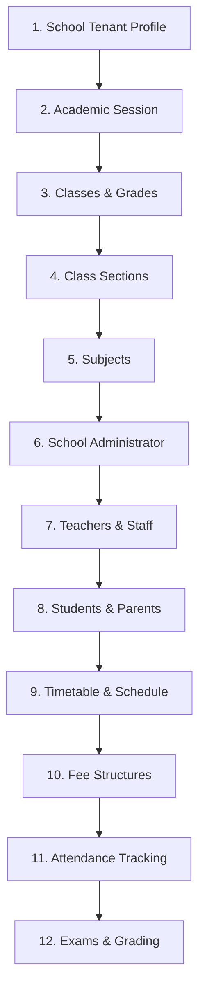

# First Real School Setup Runbook — EduManage Pro

## 1. Recommended Initialization Sequence

Follow this exact order when provisioning a new school to maintain foreign key integrity and academic structure:

---

## 2. Step-by-Step Onboarding Instructions

### Step 1: Create School Tenant Profile
- Navigate to `/dashboard/super-admin/schools` as Platform Super Admin.
- Click **Add New School**. Enter School Name, Code, Email, Address, Currency (`USD`), and Subscription Plan (`PROFESSIONAL`).

### Step 2: Initialize Academic Session
- Sign in as School Admin.
- Navigate to `/dashboard/settings/academic-session`.
- Create new session (e.g. `2026-2027 Academic Session`), set Start/End dates, and mark `isCurrent = true`.

### Step 3: Define Classes & Sections
- Navigate to `/dashboard/settings/classes`.
- Create Classes (e.g. `Grade 9`, `Grade 10`, `Grade 11`, `Grade 12`).
- Add Sections under each Class (`Section A`, `Section B`).

### Step 4: Configure Subjects & Assign Teachers
- Add Subjects (`Mathematics`, `English`, `Physics`, `Computer Science`).
- Create Teacher profiles under `/dashboard/users/teachers`.
- Assign Teachers to Subjects and Sections.

### Step 5: Admit Students & Link Parents
- Go to `/dashboard/users/students/create` or use CSV bulk import (`/dashboard/import-export`).
- Enter Admission Number, Roll Number, Gender, and link Parent user profiles.

### Step 6: Configure Fee Structures & Invoices
- Navigate to `/dashboard/finance/fees`.
- Create Fee Structure (e.g. `Tuition Fee Term 1` = `$500`).
- Generate invoices for students.
