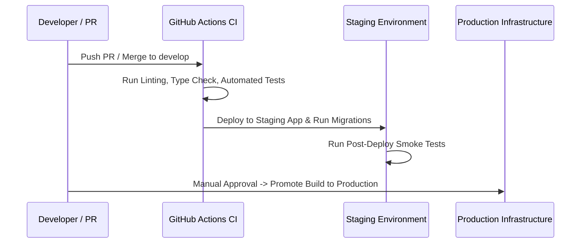

# Staging Environment Setup & Release Verification — EduManage Pro

## 1. Staging Environment Goals

The Staging environment provides an exact replica of Production infrastructure for release validation, migration smoke tests, performance testing, and multi-tenant isolation verification.

---

## 2. Infrastructure Separation Rules

1. **SEPARATE DATABASE**: Staging MUST connect to a distinct PostgreSQL database (`school_ms_staging`). Staging MUST NEVER connect to the Production database.
2. **SEPARATE STORAGE**: File uploads MUST use a dedicated Staging bucket (`edumanage-staging-storage`) or local directory (`/var/data/staging/uploads`).
3. **TEST INTEGRATION KEYS**: Email, WhatsApp, and SMS integrations MUST use sandbox/test credentials in Staging.

---

## 3. Staging Deployment Protocol

---

## 4. Staging Verification Checklist

- [ ] Execute `npx prisma migrate deploy` on Staging DB.
- [ ] Create test schools, test students, test fee payments.
- [ ] Verify realtime SSE notifications across test browsers.
- [ ] Confirm communication dispatcher records logs without sending real external emails/SMS.
- [ ] Verify multi-tenant isolation (School A cannot see School B data).
